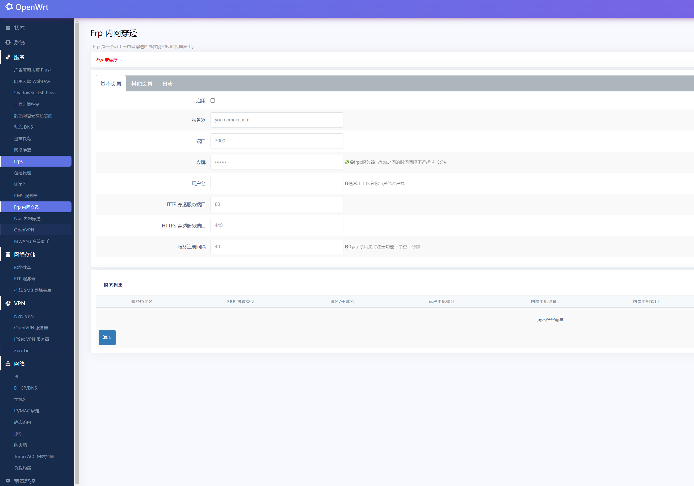
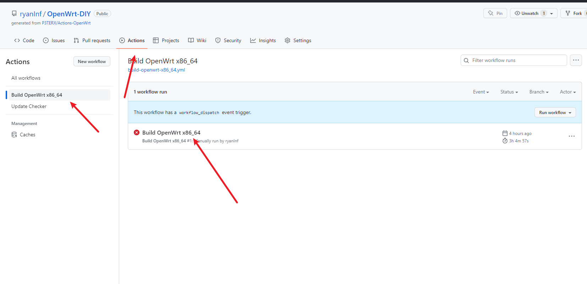
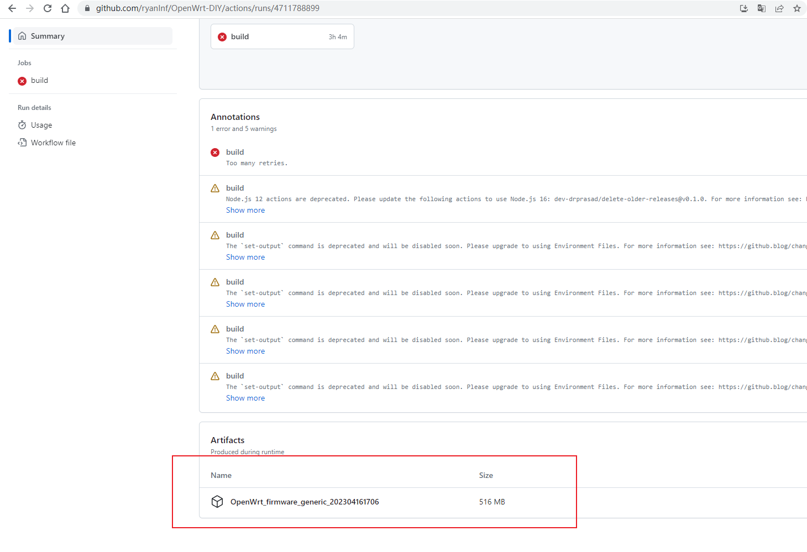

# Opewrt-DIY
lan:192.168.1.1 root/password

基本上常用的组网工具、IPV6、组播代理、mwan3等常用的工具都已安装，懂的用吧。

# x86 版本
x86通用固件，可物理机、VMware、PVE等部署。 
- 默认已编译VMware、PVE、IMG格式文件，方便部署 
- rootfs已增大到4GB，可以装更多插件，更能折腾 

# MSG1500
瑞斯康达MSG1500路由器，买了一个但一个月不到就挂了，性能一般般，跑Wireguard性能很差。 
- CPU: MediaTek MT7621A 
- WIFI: MT7615DN,  2.4G(2T2R),  5G(2T2R) 
- MEM: 南亚内存DDR3-256M:  型号：NT5CC128M16IP-DI 
- 闪存：Winbond NAND FLASH 128M 
 

# ZN-M2
兆能ZN-M2，CPU性能比较强，但内存刷入Openwrt后仅剩140MB左右，如果要跑多个插件需要硬改内存。 
- CPU: IPQ6000 
- MEM: 256M 
- 闪存：128M 

# 怎么用？
点击上方Actions，点击"Build OpenWrt xxx"，其中xxx为你想下载的路由器版本，找的最新的Actions workflow 下载生成的Artifacts即可，虽然可能提示错误实际是已经生成好固件可正常使用。

你也可以Fork本项目，然后自行修改对应的配置文件。

# 感谢
https://github.com/coolsnowwolf/lede
https://p3terx.com/archives/build-openwrt-with-github-actions.html